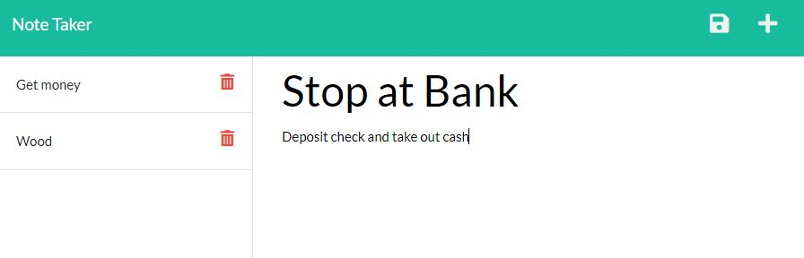

# Notes-for-GOATS

Built for saving notes to keep track of the things you still need to do

## Usage

1. Go to https://notes-for-goats.herokuapp.com/
2. Click the 'Get Started' button
3. Enter notes for what you have to do
4. Delete notes after you complete the tasks

## Visuals

## Credits

* Starter code

* Activity 19 code